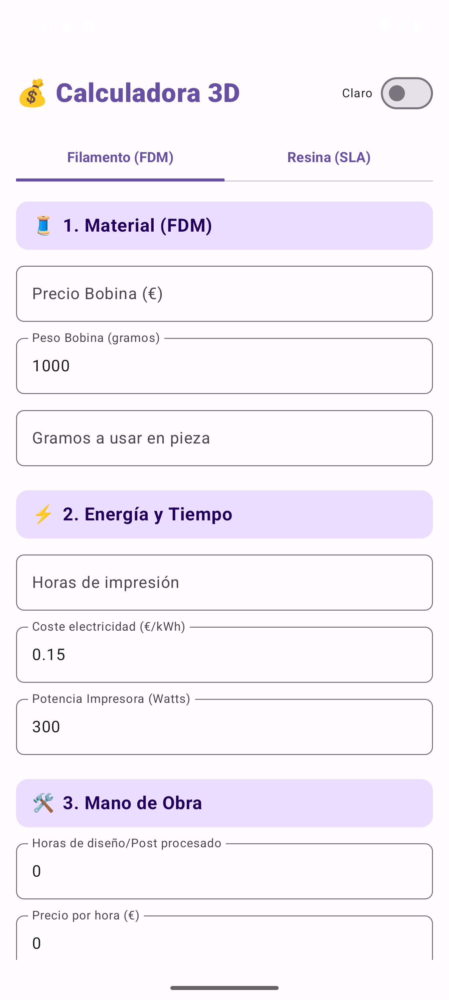
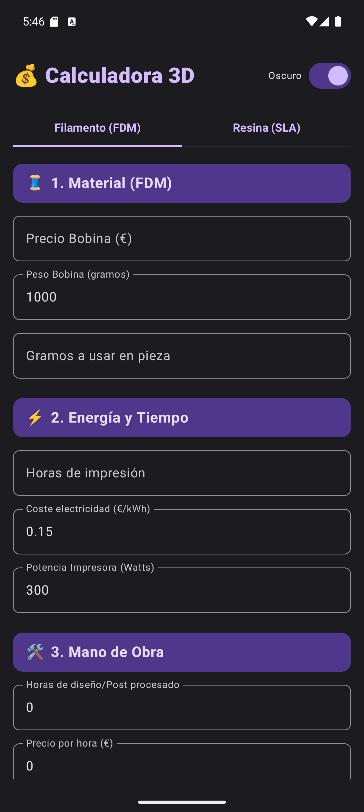
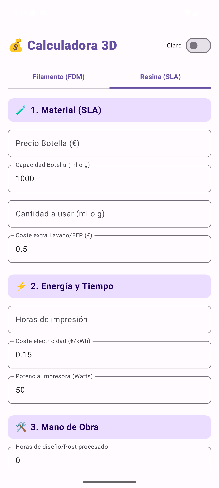
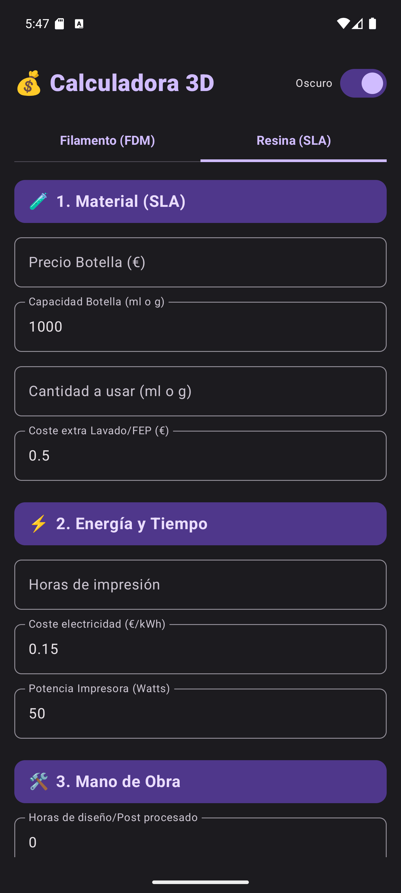

# 💰 Calculadora de Costes de Impresión 3D

Una aplicación Android nativa, moderna y sencilla diseñada para *makers* de la impresión 3D. Permite calcular con precisión el coste total de una pieza impresa y sugiere un precio de venta final (PVP) incluyendo margen de beneficio e IVA.

## 📱 Previsualización de la App

<table style="width:100%; text-align:center;">
  <tr>
    <th>☀️ Modo Claro</th>
    <th>🌙 Modo Oscuro</th>
  </tr>
  <tr>
    <td align="center">
      <b>🧵 Filamento (FDM)</b> 
       
    </td>
    <td align="center">
      <b>🧵 Filamento (FDM)</b> 
       
    </td>
  </tr>
  <tr>
    <td align="center">
      <b>🧪 Resina (SLA)</b> 
       
    </td>
    <td align="center">
      <b>🧪 Resina (SLA)</b> 
       
    </td>
  </tr>
</table>

## ✨ Novedades (Última Actualización)

¡Ahora Calculadora3D es una herramienta "Todo en Uno"! He unificado el cálculo para las dos tecnologías de impresión más populares en una sola interfaz:

* 🧵 🧪Soporte Dual (FDM y SLA): Alterna fácilmente entre presupuestos para **Filamento** y **Resina** usando el nuevo sistema de pestañas.
* 🧤 Costes Ocultos de Resina: Añadido un campo específico para calcular los gastos extra del lavado, curado, alcohol isopropílico (IPA) y desgaste del FEP.
* 🔌 Ajuste Inteligente de Energía: Al cambiar entre FDM y SLA, la calculadora ajusta automáticamente la potencia media típica de la máquina para ahorrarte tiempo.

## 🧾 Características Principales

Esta herramienta desglosa el coste en cuatro bloques fundamentales:

* 🧵 Coste del Material: Calcula el precio exacto del filamento o resina consumido basándose en el precio de la bobina y su peso.
* ⚡ Energía y Tiempo: Estima el gasto eléctrico según la potencia de tu impresora (Watts), el coste del kWh y las horas de impresión.
* 🛠️ Mano de Obra: Permite añadir costes por horas de diseño, laminado (slicing) o post-procesado.
* 📈 Beneficio e Impuestos:
    * Aplica un porcentaje de margen de ganancia configurable.
    * Calcula automáticamente el 21% de IVA.
    * Muestra el Precio Final (PVP) desglosado.

## 🛠️ Tecnologías Usadas

* Lenguaje: Kotlin
* UI Toolkit: Jetpack Compose
* Diseño: Material Design 3 (Material You)
* IDE: Android Studio Ladybug/Meerkat

## 🚀 Cómo usar este proyecto

1.  Clonar el repositorio:
   
    git clone [https://github.com/AndyMonCode/Calculadora3D.git](https://github.com/AndyMonCode/Calculadora3D.git)
    
2.  Abrir en Android Studio:
    Selecciona la carpeta Calculadora3D y espera a que Gradle sincronice las dependencias.
3.  Ejecutar:
    Conecta tu dispositivo Android o usa un emulador y pulsa el botón Run ▶️.

## 📥 Descargar APK

Puedes descargar la última versión instalable (.apk) desde la sección de Releases de este repositorio.

[Ir a Descargas](https://github.com/Manguerote/Calculadora3D/releases)

---

Desarrollado por [AndyMonCode](https://github.com/AndyMonCode)
